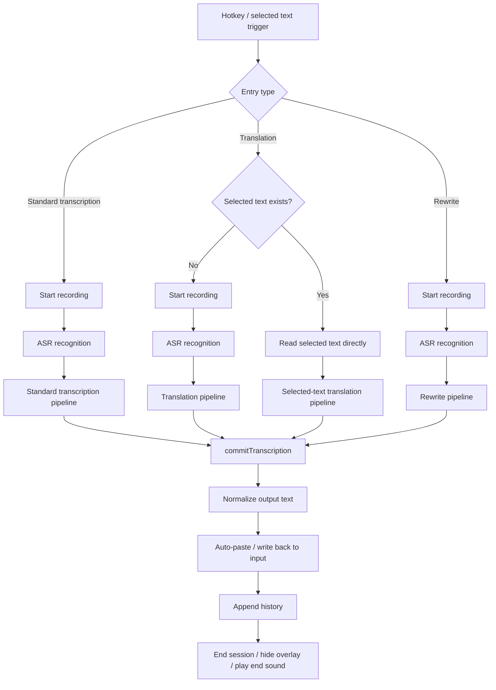
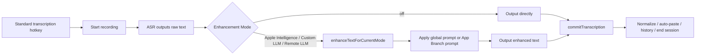
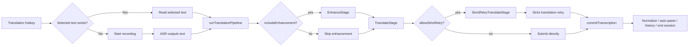
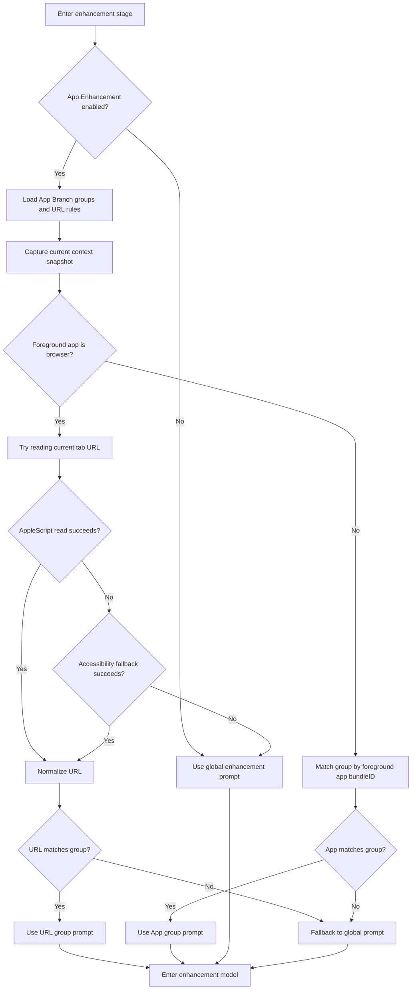

# Prompt

This document summarizes Voxt's current default prompts, template variables, runtime rules, and recommended writing patterns, so custom prompts remain stable and predictable in the main window.

> [!IMPORTANT]
> Most prompts in Voxt are not "chat-style conversational prompts". They are single-turn task prompts. The best results usually come from prompts that are explicit, constrained, and strict about output boundaries.

## Call Flow

Prompt-related functionality in Voxt mainly falls into three core chains:

- Standard transcription: `ASR -> text enhancement -> output`
- Translation: `ASR / selected text -> optional enhancement -> translation -> output`
- Rewrite / prompt: `ASR -> prompt enhancement -> rewrite / generate -> output`

All of them eventually converge into the same final submission stage:

- normalize output text
- write it back into the current input target
- append it to history
- finalize and close the current session

### Overall Flow Diagram



### Unified Entry Stage

No matter which feature is used, the flow usually starts with these steps:

1. Trigger entry
   - Standard transcription: transcription hotkey
   - Translation: translation hotkey or direct selected-text translation
   - Rewrite: rewrite hotkey
2. Permission preflight
   - Microphone
   - Speech recognition when needed
   - Accessibility / Input Monitoring affects later interaction behavior, but does not always block the full chain from starting
3. Session initialization
   - create a new `sessionID`
   - record the current output mode: `transcription` / `translation` / `rewrite`
   - initialize overlay, recording state, and timing fields
4. Select recognition engine
   - `MLX Audio`
   - `Remote ASR`
   - `Direct Dictation`
5. Wait for ASR result
   - once recording ends, recognized text arrives
   - the text goes through a small normalization layer before entering the corresponding pipeline

### Standard Transcription Call Flow

Standard transcription maps to the default `fn`.

#### Diagram



#### Stage-by-stage explanation

1. ASR stage
   - Uses local ASR, remote ASR, or system dictation based on current settings
   - Once recognition finishes, it enters `processTranscription(...)`
2. Dispatch stage
   - If `sessionOutputMode` is standard transcription, Voxt enters `processStandardTranscription(...)`
3. Enhancement stage
   - `enhancementMode = off`
     - output raw ASR text directly
   - `enhancementMode = appleIntelligence / customLLM / remoteLLM`
     - enters `runStandardTranscriptionPipeline(...)`
     - this pipeline currently has one main Stage: `TranscriptionEnhanceStage`
4. Prompt resolution stage
   - calls `resolvedEnhancementPrompt(rawTranscription:)`
   - if App Branch is enabled and the current App / URL matches a group, that App Branch prompt is preferred
   - otherwise the global text enhancement prompt is used
5. LLM enhancement stage
   - calls the selected enhancement model
   - possible backends: Apple Intelligence, local Custom LLM, or Remote LLM
6. Submission stage
   - calls `commitTranscription(...)`
   - then enters the unified output pipeline

#### What prompts do in this chain

- Standard transcription normally only uses the text enhancement prompt
- If `enhancementMode = off`, no prompt is used at all
- If App Branch is enabled, the text enhancement prompt may be partially replaced or specialized by a group prompt

### Translation Call Flow

Translation maps to the default `fn+shift`, and it actually has two entry paths:

- voice translation: ASR first, then translation
- selected-text translation: skip ASR and translate the current selection directly

#### Diagram



#### Voice translation stages

1. Recording + ASR
   - the user speaks
   - ASR returns raw text
2. Enter translation branch
   - `sessionOutputMode == .translation`
   - Voxt calls `processTranslatedTranscription(...)`
3. Run translation pipeline
   - `runTranslationPipeline(text, targetLanguage, includeEnhancement: true, allowStrictRetry: false)`
4. EnhanceStage
   - first calls `enhanceTextIfNeeded(...)`
   - in other words, voice translation is "enhance first, translate second"
   - this stage uses the text enhancement prompt and may also hit App Branch
5. TranslateStage
   - then calls `translateText(...)`
   - this stage uses the translation prompt
6. Submit output
   - returns the translated text
   - enters the unified output pipeline

#### Selected-text translation stages

1. Selection detection
   - if "translate selected text" is enabled and selection exists
   - Voxt goes straight into `beginSelectedTextTranslationIfPossible()`
2. Skip recording and ASR
   - selected text becomes the input directly
3. Run translation pipeline
   - `runTranslationPipeline(text, targetLanguage, includeEnhancement: false, allowStrictRetry: true)`
4. Skip enhancement
   - direct selected-text translation does not run the enhancement prompt first
5. Translate directly
   - uses `TranslateStage`
6. Strict retry
   - if the first result looks too close to the source text, Voxt triggers `StrictRetryTranslateStage`
   - it retries once using a stricter translation prompt
7. Submit output
   - writes the translated text back into the selection / input target

#### What prompts do in this chain

- Voice translation:
  - first uses the text enhancement prompt
  - then uses the translation prompt
- Selected-text translation:
  - skips enhancement by default
  - uses the translation prompt directly
  - may add a stricter retry pass when needed

### Rewrite Call Flow

Rewrite maps to the default `fn+control`. It is best understood as "treat ASR output as an instruction", then combine it with selected text when present.

#### Diagram


#### Stage-by-stage explanation

1. Recording + ASR
   - the user dictates "what should be written"
   - ASR turns the spoken instruction into text
2. Enter rewrite branch
   - `sessionOutputMode == .rewrite`
   - Voxt calls `processRewriteTranscription(...)`
3. Read selected text
   - tries to read current selection through Accessibility or simulated copy
   - the selection may be empty
4. Run rewrite pipeline
   - `runRewritePipeline(dictatedText, selectedSourceText)`
   - the pipeline currently includes:
     - `EnhanceStage`
     - `RewriteStage`
5. EnhanceStage
   - first enhances the dictated instruction itself
   - this calls `enhanceTextIfNeeded(...)`
   - it may use the text enhancement prompt or App Branch prompt
6. RewriteStage
   - calls `rewriteText(dictatedPrompt, sourceText)`
   - uses the rewrite prompt
   - if selected text exists: rewrite the source according to the spoken instruction
   - if selected text is empty: generate text directly from the spoken instruction
7. Submit output
   - returns the final text that should be inserted
   - then enters the unified output pipeline

#### Failure fallback

If the rewrite stage fails:

- Voxt tries to fall back to the enhanced dictated instruction itself
- in other words, it tries to return something usable instead of dropping the result entirely

### Unified Submission and Finalization

All three main chains eventually pass through the same output submission logic.

#### Submission Diagram


#### Stage-by-stage explanation

1. `NormalizeOutputStage`
   - applies final normalization to the output text
2. `TypeTextStage`
   - writes the text back to the current input target
   - if permissions are insufficient, it may fall back to clipboard-only behavior
3. `AppendHistoryStage`
   - writes the result into history
   - includes related model / provider / mode metadata
4. `finishSession(...)`
   - delays finalization slightly in some modes, so the user can still see the result
5. `executeSessionEndPipeline()`
   - hide overlay
   - play end sound
   - reset current session state

### One-line Summary

- Standard transcription: `ASR -> enhancement -> output`
- Voice translation: `ASR -> enhancement -> translation -> output`
- Selected-text translation: `selection -> translation -> optional strict retry -> output`
- Rewrite: `ASR -> enhance dictated instruction -> rewrite / generate -> output`

Prompts mainly participate in the enhancement, translation, and rewrite LLM stages, not in recording itself.

### App Branch Call Flow

`App Branch` is not a standalone ASR or LLM pipeline. It behaves more like a dynamic prompt router inside the enhancement stage.

It mainly affects:

- the enhancement stage of standard transcription
- the enhancement stage before voice translation
- the dictated-instruction enhancement stage in rewrite

It does not normally affect:

- direct selected-text translation
  because this chain uses `includeEnhancement = false` by default

#### App Branch Match Flow Diagram



#### Stage-by-stage explanation

1. Enter enhancement stage
   - standard transcription calls `enhanceTextForCurrentMode(...)`
   - translation / rewrite calls `enhanceTextIfNeeded(...)`
   - both eventually pass through `resolvedEnhancementPrompt(rawTranscription:)`
2. Feature switch check
   - if `appEnhancementEnabled = false`
   - Voxt falls back directly to the global enhancement prompt
   - no App / URL matching is attempted
3. Load group configuration
   - load App Branch groups
   - load URL rules
   - if there are no groups at all, Voxt also falls back directly to the global prompt
4. Capture context snapshot
   - records current foreground app `bundleID`
   - records a timestamp
   - this is meant to keep enhancement aligned with the context around recording stop, instead of whatever the user switched to later
5. Decide whether current context is browser-based
   - if the foreground app is a browser, Voxt prioritizes URL-level matching
   - otherwise it only performs app-level matching

#### Browser URL Match Path

When the foreground app is a browser, App Branch prefers URL matching.

1. First try AppleScript to read the active tab URL
   - Safari
   - Chrome
   - Edge
   - Brave
   - Arc
   - or any custom browser added in the main window
2. If script-based reading fails
   - try `Accessibility` fallback and read the browser window's `AXDocument`
3. If URL reading succeeds
   - normalize the URL first, for example into a host/path matching format
   - then match URL groups using wildcard rules
4. If a URL group matches
   - use that group's prompt
   - and record it as a URL-based hit
5. If the URL cannot be read or no URL group matches
   - current implementation does not continue into "browser app-group matching first"
   - instead it falls back directly to the global enhancement prompt

> [!IMPORTANT]
> In browser contexts, URL matches have higher priority than normal app matches. But if URL reading fails or the URL does not match any group, current logic falls back directly to the global prompt instead of continuing to match a browser app group.

#### Normal App Match Path

If the foreground app is not a browser, App Branch matches by `bundleID`.

1. Read the current foreground app `bundleID`
2. Traverse App Branch groups
3. Check whether the app belongs to any group
4. If a group matches and its prompt is not empty
   - use that group prompt
5. If no group matches
   - fall back to the global enhancement prompt

#### Prompt Delivery Style After a Match

There is an important implementation detail here:

- global enhancement prompt
  - usually delivered as a `systemPrompt`
- App Branch matched prompt
  - currently tends to be delivered more like a `userMessage`

This means:

- the global prompt behaves more like a shared system rule set
- the App Branch prompt behaves more like a concrete context-specific task instruction

#### Which Flows App Branch Actually Affects

1. Standard transcription
   - if enhancement is enabled, App Branch may replace the global enhancement prompt
2. Voice translation
   - App Branch may apply during the pre-translation enhancement stage
   - the actual translation stage still uses the translation prompt
3. Rewrite
   - App Branch may apply during the dictated-instruction enhancement stage
   - the final generation / rewrite stage still uses the rewrite prompt
4. Direct selected-text translation
   - does not normally go through enhancement, so App Branch usually does not participate

#### App Branch in One Sentence

You can think of App Branch as:

- not a new model
- not a new task type
- but a mechanism that decides which enhancement prompt should be used for the current context

In other words:

- first inspect the current context
- then decide whether to use the global prompt, a URL prompt, or an App prompt
- finally send the chosen prompt into the current enhancement model

## Template Variables

Voxt currently includes the following built-in template variables:

| Variable | Purpose | Typical Use |
| --- | --- | --- |
| `{{RAW_TRANSCRIPTION}}` | Raw transcription text before enhancement | Text enhancement, App Branch |
| `{{USER_MAIN_LANGUAGE}}` | The user's resolved primary spoken language or language mix | Text enhancement, translation, App Branch, ASR hint prompts |
| `{{TARGET_LANGUAGE}}` | Currently selected translation target language, such as English or Japanese | Translation |
| `{{SOURCE_TEXT}}` | Source text that will be translated or rewritten | Translation, rewrite |
| `{{DICTATED_PROMPT}}` | Spoken rewrite / generation instruction captured from dictation | Rewrite |

Additional notes:

- `{{RAW_TRANSCRIPTION}}` is mainly used for post-recognition cleanup
- `{{USER_MAIN_LANGUAGE}}` is resolved from the user's selected main language settings and may represent one or multiple languages
- `{{SOURCE_TEXT}}` is mainly used when existing text needs to be processed
- `{{DICTATED_PROMPT}}` represents the user's spoken intent, not the final output text
- `{{TARGET_LANGUAGE}}` is injected automatically from the app's current translation target setting

> [!NOTE]
> The current code still supports the legacy translation variable `{target_language}`, but all new prompt configurations should use `{{TARGET_LANGUAGE}}`.

## Text Enhancement Prompt

Text enhancement is used for lightweight cleanup of speech recognition results, such as punctuation fixes, paragraph formatting, and filler removal, without changing the original meaning.

### Default Prompt

```text
You are Voxt's transcription cleanup assistant, responsible for precise cleanup of raw text generated by speech recognition.

User main language:
{{USER_MAIN_LANGUAGE}}

Follow these cleanup rules strictly, in priority order:
1. Resolve self-corrections first. If the speaker negates, cancels, or changes an earlier phrase mid-speech, keep only the final confirmed valid content. Delete the old content overridden by later speech and correction cues such as "no", "not that", "no no no", "forget it", "change it to", and similar phrases. Do not treat historical narration as a correction when it explains past right/wrong actions, contrasts actions at different times, or otherwise needs the full statement preserved. Example: "I will go to Shanghai tomorrow, no, the day after tomorrow" becomes "I will go to Shanghai the day after tomorrow"; "Yesterday I fried tomatoes first for egg fried rice, which was wrong. Today I fried eggs first and tomatoes later" should be preserved.
2. Remove non-semantic filler words and pause markers. Do not keep fillers just to preserve spoken tone. Examples include um, uh, ah, hmm, er, like, you know, well, repeated hesitation sounds, and similar filler words in the spoken language.
3. Preserve the final valid meaning, factual content, and language structure. Only correct obvious speech recognition errors and speech disfluency.
4. Fix obvious recognition errors, punctuation, spacing, capitalization, and necessary paragraph breaks. For punctuation, evaluate the user's main-language punctuation habits and the surrounding context. Replace spoken punctuation-symbol words with the corresponding punctuation mark only when they are being used as punctuation, such as replacing "exclamation mark" or "感叹号" with "!", "comma" or "逗号" with ",", "period" or "句号" with ".", "question mark" or "问号" with "?", "colon" or "冒号" with ":", "semicolon" or "分号" with ";", "quotation marks" or "引号" with quotation marks, "parentheses" or "括号" with parentheses, "square brackets" or "中括号" with square brackets, and "braces" or "大括号" with braces.
5. Format numbers, times, dates, and phone or identifier-like numbers in a standard form:
   - Convert written percentages to numeric percentages, such as "fifty percent" or "百分之五十" to "50%".
   - Use standard unit formatting, such as "three centimeters" or "三厘米" to "3cm", and "three millimeters" or "三毫米" to "3mm".
   - Normalize times, such as "one thirty in the afternoon" or "下午一点半" to "13:30".
   - Present phone numbers and similar numbers in their actual normalized format.
6. Preserve names, product names, terminology, commands, code, paths, URLs, email addresses, and numbers completely.
7. Preserve the original mixed-language structure. Do not translate, summarize, expand, explain, or change the writing style. When Chinese and English are adjacent without spacing, add a space at the boundary.
8. If the content contains ordered-list wording, format it as a numbered list. If it contains a clear non-ordered parallel relationship, format it as an unordered list using "-".
9. If no meaningful content remains after cleanup, return an empty string.

Examples:
- Input: "Um, buy apples and bananas, uh, and sugarcane. Ah no no, no sugarcane, get some loquats."
  Output: "Buy apples and bananas, and get some loquats."
- Input: "Um, I think, like, this plan can still be optimized."
  Output: "I think this plan can still be optimized."
- Input: "The project is about seventy percent complete, submit it before two fifteen p.m., this part is five centimeters long, and the phone number is 138 1234 5678."
  Output: "The project is about 70% complete, submit it before 14:15, this part is 5cm long, and the phone number is 13812345678."
- Input: "Yesterday I fried tomatoes first for egg fried rice, which was wrong. Today I fried eggs first and tomatoes later."
  Output: "Yesterday I fried tomatoes first for egg fried rice, which was wrong. Today I fried eggs first and tomatoes later."
- Input: "今天天气真好感叹号"
  Output: "今天天气真好!"
- Input: "This sentence needs emphasis at the end, so use an exclamation mark."
  Output: "This sentence needs emphasis at the end, so use an exclamation mark."
- Input: "Please put the file under parentheses D drive parentheses in the square bracket data square bracket folder."
  Output: "Please put the file under (D drive) in the [data] folder."
- Input: "The braces user braces in the code need to be replaced with the actual username."
  Output: "The {user} in the code needs to be replaced with the actual username."

Output:
Return only the adjusted text, with no extra explanation.
```

### Supported Variables

- `{{RAW_TRANSCRIPTION}}`
- `{{USER_MAIN_LANGUAGE}}`

### Runtime Notes

- If an App Branch prompt matches the current App or URL, that prompt may replace the global enhancement prompt for the enhancement stage.
- If dictionary recognition finds relevant terms, Voxt appends a runtime glossary block that prefers exact dictionary spellings when the transcript context matches.

### Usage Guidelines

- Good for lightweight cleanup, not strong rewriting
- Recommended goals to emphasize:
  - keep only the speaker's final confirmed revision when they self-correct
  - fix punctuation
  - split paragraphs
  - remove filler words with no semantic meaning
  - preserve the original language
  - align punctuation and cleanup decisions with `{{USER_MAIN_LANGUAGE}}`
- Not recommended:
  - translation
  - summarization
  - tone rewriting
  - speculative completion of omitted content

### Recommended Writing Style

- Make the input source explicit: tell the model it is processing raw transcription text
- Define priority clearly: final valid content first, then punctuation / formatting, then filler cleanup
- Define hard constraints: do not alter meaning, do not translate, do not explain
- Define output clearly: return only the final text

## Translation Prompt

The translation prompt is used for dedicated translation actions, such as the default `fn+shift`, and also for direct selected-text translation.

### Default Prompt

```text
You are Voxt's content cleanup and translation assistant, responsible for organizing user-provided content and translating it into the target language.

User main language:
{{USER_MAIN_LANGUAGE}}

Target language:
{{TARGET_LANGUAGE}}

Follow these cleanup and translation rules strictly, in priority order:
1. Resolve self-corrections first. If the speaker negates, cancels, or changes an earlier phrase mid-speech, keep only the final confirmed valid content. Delete the old content overridden by later speech and correction cues such as "no", "not that", "no no no", "forget it", "change it to", and similar phrases. Do not treat historical narration as a correction when it explains past right/wrong actions, contrasts actions at different times, or otherwise needs the full statement preserved.
2. Remove non-semantic filler words and pause markers.
3. Preserve the final valid meaning, factual content, tone, and language structure during cleanup. Only correct obvious speech recognition errors and speech disfluency before translation.
4. Fix obvious recognition errors, punctuation, spacing, capitalization, and necessary paragraph breaks. Replace spoken punctuation-symbol words with punctuation marks only when they are being used as punctuation.
5. Format numbers, times, dates, and phone or identifier-like numbers in a standard form, such as "fifty percent" to "50%", "three centimeters" to "3cm", and "one thirty in the afternoon" to "13:30".
6. Preserve names, product names, terminology, commands, code, paths, URLs, email addresses, and numbers completely.
7. Preserve the original mixed-language structure during cleanup. Do not summarize, expand, explain, or change the writing style. When Chinese and English are adjacent without spacing, add a space at the boundary before translation.
8. If the content contains ordered-list wording, format it as a numbered list. If it contains a clear non-ordered parallel relationship, format it as an unordered list using "-".
9. Translate the cleaned content into {{TARGET_LANGUAGE}} accurately, preserving the original meaning without arbitrary additions or omissions.
10. If no meaningful content remains after cleanup, return an empty string.

Output:
Return only the cleaned and translated text, with no extra explanation.
```

### Supported Variables

- `{{TARGET_LANGUAGE}}`
- `{{USER_MAIN_LANGUAGE}}`
- `{{SOURCE_TEXT}}` is still supported for custom prompts, but the default prompt does not embed it because Voxt supplies the source text at runtime.

### Runtime Enforcement

When translation is actually executed, Voxt appends an additional layer of mandatory rules after the base prompt:

- Normal translation mode:
  - must translate into the target language
  - preserve meaning, tone, names, numbers, and formatting
  - short linguistic text must still be translated
  - do not output explanations
  - return only the translated result
- Strict retry mode:
  - if the first output looks untranslated, Voxt retries with stricter translation rules
  - it more strongly enforces "do not copy source-language wording"
- Dictionary guidance:
  - if the source text hits dictionary terms, Voxt appends a runtime glossary instructing the model to preserve exact spellings unless translation clearly requires otherwise

> [!IMPORTANT]
> This means the final translation prompt is not only the text you wrote. Voxt appends an extra runtime layer that enforces "must translate" and "return only the result".

### Usage Guidelines

- Reference the target language with `{{TARGET_LANGUAGE}}`; only use `{{SOURCE_TEXT}}` in custom prompts when you explicitly want the source text embedded in the prompt body
- Recommended constraints:
  - preserve proper nouns
  - preserve numbers / URLs / emails
  - no explanations
  - no markdown
- Not recommended:
  - "polish it while translating"
  - "feel free to improvise"
  - "summarize if unsure"

### Recommended Writing Style

- Make it explicit that this is a translation task, not a rewrite task
- Emphasize "return translation only"
- If you have fixed terminology, include a glossary or terminology rules
- If you want a more formal or more conversational style, that can be added, but it should not conflict with faithfulness to the source

## Rewrite Prompt

Here "rewrite" is closer to a voice-driven generation / transformation prompt. The default shortcut is `fn+control`.

It has two typical scenarios:

- no selected text: treat dictated content directly as a prompt and generate output
- selected text exists: treat dictated content as a rewrite instruction applied to the selected text

### Default Prompt

```text
You are Voxt's content writing assistant. Use the spoken instruction and the optional selected source text to produce the final text that should be inserted into the current input field.

Spoken instruction:
<spoken_instruction>
{{DICTATED_PROMPT}}
</spoken_instruction>

Selected source text:
<selected_source_text>
{{SOURCE_TEXT}}
</selected_source_text>

Rules:
1. Treat the spoken instruction as the user's intent for what to write or how to transform the selected source text.
2. If selected source text is present, use it as the original content to rewrite, expand, shorten, reply to, or otherwise transform according to the spoken instruction.
3. If selected source text is empty, generate the requested content directly from the spoken instruction.
4. Return only the final text to insert, with no explanations, markdown, labels, or commentary.
```

### Supported Variables

- `{{DICTATED_PROMPT}}`
- `{{SOURCE_TEXT}}`

### Runtime Enforcement

When rewrite is executed, Voxt may append additional runtime constraints after the base prompt:

- Direct-answer mode:
  - if there is no selected source text, Voxt explicitly tells the model to treat the spoken instruction as the full request and to output the actual answer directly
- Structured answer mode:
  - when the rewrite answer card expects structured output, Voxt temporarily requires a JSON object with exactly `title` and `content`
  - `content` must contain the final answer text only
- Non-empty retry:
  - if a previous structured answer returned empty content, Voxt retries once with a stronger non-empty requirement
- Dictionary guidance:
  - if relevant terms match the dictionary, Voxt appends a glossary block asking the model to prefer exact spellings in the final output

### Usage Guidelines

- Clearly distinguish the spoken instruction from the source text
- Emphasize that the goal is the final text to insert into the input field
- Make "return only the result" explicit
- If you have a specific writing scenario, you can add rules such as:
  - reply to email
  - shorten a sentence
  - expand into a full paragraph
  - make it more polite / professional / conversational

### Recommended Writing Style

- Write separate rules for the "selection exists" and "no selection" cases
- Be explicit about actions like rewrite / expand / shorten / reply
- Avoid generic chatbot wording; keep it task-oriented

## App Branch Prompt

An App Branch prompt is still fundamentally a text enhancement prompt, but it switches dynamically based on the current App or URL group.

Compared with the global text enhancement prompt:

- the global enhancement prompt is normally delivered as a system prompt
- an App Branch matched prompt currently tends to participate more like user-side content
- App Branch is better suited to context-specific rules, for example different app-specific style, terminology, or formatting

### Supported Variables

- `{{RAW_TRANSCRIPTION}}`
- `{{USER_MAIN_LANGUAGE}}`

### What It Is Good For

- IDE / programming tools:
  - preserve code, commands, and English technical terms
  - do not translate API names into Chinese
- Chat tools:
  - shorter phrasing
  - more conversational tone
  - remove repetitive filler wording
- Email / document tools:
  - more formal style
  - complete sentence structure
  - clearer paragraph breaks
- Certain websites:
  - preserve site-specific terminology
  - output in a style that matches the website context

### Usage Guidelines

- Prefer writing only the context-specific differences, instead of repeating the full global enhancement rules
- Prefer context-bound constraints such as:
  - preserve code blocks
  - do not translate terminology
  - use a more formal tone
  - keep the output concise
- If the App Branch prompt conflicts with the global prompt, structure it as a local supplement rather than a competing full instruction set

> [!TIP]
> App Branch prompts are best for solving "different contexts require different speaking styles / output rules". They are not a replacement for a full translation or generation prompt system.

## ASR Hint Prompts

ASR hint prompts are separate from LLM enhancement / translation / rewrite prompts. They are provider-specific recognition hints used before text enters the main LLM pipeline.

Current behavior in code:

- `OpenAI Whisper` supports a short prompt template plus language selection
- `GLM ASR` supports a short prompt template
- `MLX Audio`, `Doubao ASR`, and `Aliyun Bailian ASR` currently use resolved language hints only and do not apply a custom prompt template

### Supported Variable

- `{{USER_MAIN_LANGUAGE}}`

### Default OpenAI ASR Hint Prompt

```text
The speaker's primary language is {{USER_MAIN_LANGUAGE}}. Prioritize accurate transcription in that language while preserving mixed-language words, names, product terms, URLs, and code-like text exactly as spoken.
```

### Default GLM ASR Hint Prompt

```text
The speaker's primary language is {{USER_MAIN_LANGUAGE}}. Prioritize accurate recognition in that language. Preserve names, terminology, mixed-language content, and code-like text exactly as spoken.
```

### Practical Notes

- Keep ASR hint prompts short; they are recognition bias, not generation prompts
- `Doubao ASR` uses language hints and automatically follows the selected simplified or traditional Chinese main language variant
- `Aliyun Bailian ASR` derives language hints from the user's selected main languages

## Prompt Writing Guidelines

Regardless of prompt type, the following general rules are recommended:

### 1. Define task boundaries clearly

- Is this enhancement, translation, rewriting, or generation?
- Is tone rewriting allowed?
- Is content deletion allowed?
- Is translation allowed?

### 2. Define output format clearly

- Best practice is to write it directly: `Return only the final text`
- no explanations
- no titles
- no markdown
- no labels or annotations

### 3. Prefer variables over handwritten placeholder descriptions

Recommended:

```text
Source text:
{{SOURCE_TEXT}}
```

Not recommended:

```text
Source text: [the selected text]
```

### 4. Do not pack too many goals into one prompt

For example, a single prompt that simultaneously asks for:

- translation
- polishing
- summarization
- tone rewriting
- output as a bullet list

This kind of mixed objective usually makes output unstable. In most cases, one prompt should focus on one main task.

### 5. Make constraints concrete, not vague

Recommended:

- preserve proper nouns and numbers
- do not translate code, commands, or URLs
- remove non-semantic filler words
- make the tone more formal without expanding content

Not recommended:

- make it better somehow
- make it smarter
- feel free to improvise

### 6. Validate with small samples after editing

At minimum, test with:

- short sentences
- long paragraphs
- mixed Chinese/English content
- text containing code / commands / URLs
- translation or rewrite flows with selected text

## Prompt Tools

- [Volcengine PromptPilot](https://promptpilot.volcengine.com)
- [Dify](https://dify.ai/)
