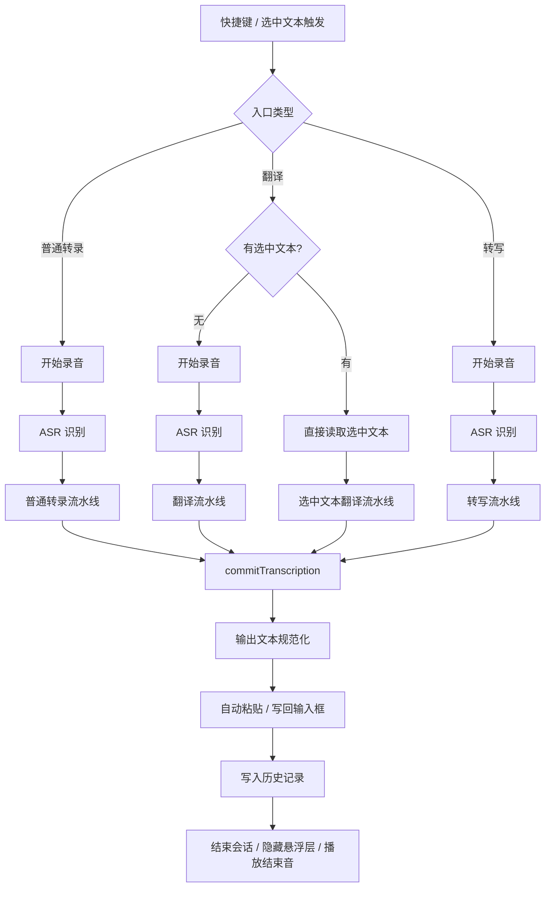
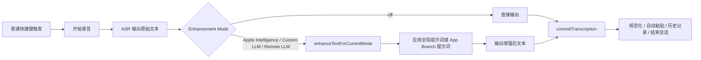
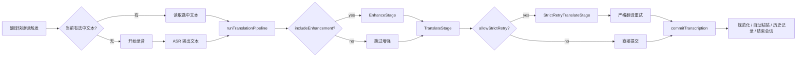
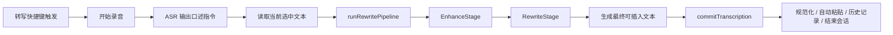
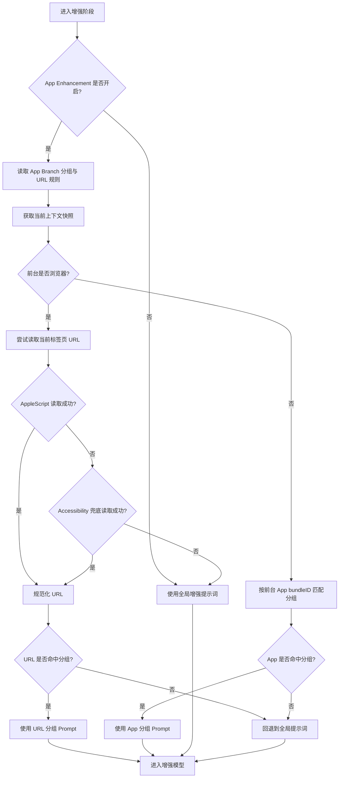

# 提示词

本文档整理 Voxt 当前应用中的默认提示词、模板变量、运行规则和推荐写法，方便你在设置里自定义提示词时保持输出稳定。

> [!IMPORTANT]
> Voxt 中的大多数提示词都不是“聊天式对话提示词”，而是“单轮任务提示词”。推荐写得明确、约束清楚、输出边界严格，避免让模型自由发挥。

## 调用流

Voxt 中与提示词相关的能力，核心上有三条主链路：

- 普通转录：`ASR -> 文本增强 -> 输出`
- 翻译：`ASR / 选中文本 -> 可选增强 -> 翻译 -> 输出`
- 转写：`ASR -> 提示词增强 -> 改写 / 生成 -> 输出`

它们最终都会走到统一的“结果提交”阶段：

- 规范化输出文本
- 自动写回当前输入位置
- 追加到历史记录
- 收尾并结束当前会话

### 总体流程图



### 统一入口阶段

无论哪一种功能，基本都会先经过这几个步骤：

1. 触发入口
   - 普通转录：普通快捷键
   - 翻译：翻译快捷键，或“选中文本直译”
   - 转写：转写快捷键
2. 权限预检查
   - 麦克风
   - 如有需要，语音识别
   - 辅助功能 / 输入监控影响的是后续交互，不一定阻止整条链路启动
3. 会话初始化
   - 创建新的 `sessionID`
   - 记录当前输出模式：`transcription` / `translation` / `rewrite`
   - 初始化悬浮层、录音状态、计时信息
4. 选择识别引擎
   - `MLX Audio`
   - `Remote ASR`
   - `Direct Dictation`
5. 等待 ASR 结果
   - 录音结束后拿到识别文本
   - 文本会先做一层基础规范化，然后再进入对应流水线

### 普通转录调用流

普通转录对应默认 `fn`。

#### 流程图



#### 分阶段说明

1. ASR 阶段
   - 根据当前设置使用本地 ASR、远程 ASR 或系统听写
   - 识别完成后统一进入 `processTranscription(...)`
2. 分发阶段
   - 如果当前 `sessionOutputMode` 是普通转录，则进入 `processStandardTranscription(...)`
3. 增强阶段
   - `enhancementMode = off`
     - 直接输出 ASR 文本
   - `enhancementMode = appleIntelligence / customLLM / remoteLLM`
     - 进入 `runStandardTranscriptionPipeline(...)`
     - 该流水线当前只有一个核心 Stage：`TranscriptionEnhanceStage`
4. 提示词解析阶段
   - 调用 `resolvedEnhancementPrompt(rawTranscription:)`
   - 如果开启了 App Branch，且当前 App / URL 命中分组，则优先使用 App Branch 提示词
   - 否则使用全局文本增强提示词
5. LLM 增强阶段
   - 按当前增强模式调用对应模型
   - 可能是 Apple Intelligence、本地 Custom LLM、或 Remote LLM
6. 提交阶段
   - 调用 `commitTranscription(...)`
   - 统一进入结果输出流水线

#### 这一条链路中提示词的作用

- 普通转录默认只会使用“文本增强提示词”
- 如果 `enhancementMode = off`，则完全不走提示词
- 如果开启 App Branch，则“文本增强提示词”可能会被分组提示词局部替换或补充

### 翻译调用流

翻译对应默认 `fn+shift`，它实际上有两条入口：

- 语音翻译：先 ASR，再翻译
- 选中文本翻译：跳过 ASR，直接翻译当前选区

#### 流程图



#### 语音翻译阶段说明

1. 录音 + ASR
   - 用户说话
   - ASR 返回原始文本
2. 进入翻译分支
   - `sessionOutputMode == .translation`
   - 调用 `processTranslatedTranscription(...)`
3. 运行翻译流水线
   - `runTranslationPipeline(text, targetLanguage, includeEnhancement: true, allowStrictRetry: false)`
4. EnhanceStage
   - 先调用 `enhanceTextIfNeeded(...)`
   - 也就是说，语音翻译默认是“先增强，再翻译”
   - 这里会使用文本增强提示词，且可能命中 App Branch
5. TranslateStage
   - 再调用 `translateText(...)`
   - 这里使用翻译提示词
6. 提交输出
   - 返回译文
   - 进入统一提交流程

#### 选中文本翻译阶段说明

1. 检测选区
   - 如果开启了“选中文本翻译”功能，且当前存在选中内容
   - 直接进入 `beginSelectedTextTranslationIfPossible()`
2. 跳过录音和 ASR
   - 选中文本直接作为输入
3. 运行翻译流水线
   - `runTranslationPipeline(text, targetLanguage, includeEnhancement: false, allowStrictRetry: true)`
4. 不做增强
   - 选中文本直译默认不先走增强提示词
5. 直接翻译
   - 走 `TranslateStage`
6. 严格重试
   - 如果第一次结果看起来和原文几乎一样，Voxt 会触发 `StrictRetryTranslateStage`
   - 用更强约束的翻译提示词重试一次
7. 提交输出
   - 将译文写回选区 / 输入位置

#### 这一条链路中提示词的作用

- 语音翻译：
  - 先用“文本增强提示词”
  - 再用“翻译提示词”
- 选中文本翻译：
  - 默认跳过增强
  - 直接使用“翻译提示词”
  - 必要时再加一层严格翻译规则重试

### 转写调用流

转写对应默认 `fn+control`，本质是“把语音识别结果当作指令”，再结合选中文本做生成或改写。

#### 流程图



#### 分阶段说明

1. 录音 + ASR
   - 用户口述“要怎么写”
   - ASR 把这段口述转成文本
2. 进入转写分支
   - `sessionOutputMode == .rewrite`
   - 调用 `processRewriteTranscription(...)`
3. 读取选中文本
   - 通过辅助功能或模拟复制读取当前选区
   - 选区可能为空
4. 运行转写流水线
   - `runRewritePipeline(dictatedText, selectedSourceText)`
   - 当前包含两个 Stage：
     - `EnhanceStage`
     - `RewriteStage`
5. EnhanceStage
   - 先对口述指令本身做增强
   - 这里调用 `enhanceTextIfNeeded(...)`
   - 可能命中文本增强提示词或 App Branch 提示词
6. RewriteStage
   - 调用 `rewriteText(dictatedPrompt, sourceText)`
   - 使用“转写提示词”
   - 如果有选中文本：按口述要求改写原文
   - 如果没有选中文本：按口述要求直接生成文本
7. 提交输出
   - 返回最终应插入输入框的文本
   - 统一进入输出流水线

#### 失败兜底

如果转写阶段失败：

- Voxt 会尝试把“增强后的口述指令”直接作为 fallback 输出
- 也就是说，最差情况下不会完全丢结果，而是尽量回退到可用文本

### 统一提交与收尾阶段

三条主链路最终都会走到统一的结果提交逻辑。

#### 提交流程图


#### 分阶段说明

1. `NormalizeOutputStage`
   - 对最终输出文本做统一规范化
2. `TypeTextStage`
   - 自动写回当前输入位置
   - 如果没有足够权限，可能退化为只保留在剪贴板
3. `AppendHistoryStage`
   - 把结果写入历史记录
   - 同时带上必要的模型 / provider / 模式信息
4. `finishSession(...)`
   - 延迟收尾（某些模式下会稍微停留，让用户看到结果）
5. `executeSessionEndPipeline()`
   - 隐藏悬浮层
   - 播放结束音
   - 重置当前 session 状态

### 一句话总结

- 普通转录：`ASR -> 增强 -> 输出`
- 语音翻译：`ASR -> 增强 -> 翻译 -> 输出`
- 选中文本翻译：`选区 -> 翻译 -> 可选严格重试 -> 输出`
- 转写：`ASR -> 增强口述指令 -> 改写 / 生成 -> 输出`

提示词主要参与的是“增强 / 翻译 / 转写”这三个 LLM 阶段，而不是录音本身。

### App Branch 调用流

`App Branch` 本身不是独立的 ASR 或 LLM 流程，它更像是“增强阶段里的动态提示词路由器”。

它主要影响这些环节：

- 普通转录的增强阶段
- 语音翻译里的增强阶段
- 转写里的口述指令增强阶段

默认不会影响：

- 选中文本直译
  原因：这条链路默认 `includeEnhancement = false`

#### App Branch 命中流程图



#### 分阶段说明

1. 进入增强阶段
   - 普通转录会调用 `enhanceTextForCurrentMode(...)`
   - 翻译 / 转写会调用 `enhanceTextIfNeeded(...)`
   - 这两个入口最终都会走到 `resolvedEnhancementPrompt(rawTranscription:)`

2. 开关判断
   - 如果 `appEnhancementEnabled = false`
   - 直接回退到全局增强提示词
   - 不做任何 App / URL 匹配

3. 加载分组配置
   - 读取 App Branch groups
   - 读取 URL rules
   - 如果没有任何分组，同样直接回退到全局增强提示词

4. 获取上下文快照
   - 记录当前前台 App 的 `bundleID`
   - 记录当前时间戳
   - 这一步是为了让后续增强阶段尽量基于“录音停止时附近”的上下文，而不是用户已经切走窗口后的上下文

5. 判断是否浏览器上下文
   - 如果当前前台 App 是浏览器，优先尝试 URL 级别匹配
   - 如果不是浏览器，则只做 App 级别匹配

#### 浏览器 URL 命中链路

当当前前台应用是浏览器时，App Branch 会优先走 URL 匹配。

1. 先尝试 AppleScript 读取当前标签页 URL
   - Safari
   - Chrome
   - Edge
   - Brave
   - Arc
   - 或设置中手动添加的自定义浏览器

2. 如果脚本读取失败
   - 再尝试 `Accessibility` 兜底读取浏览器窗口的 `AXDocument`

3. 如果 URL 读取成功
   - 先做标准化，例如统一 host/path 形式
   - 再按 wildcard 规则匹配 URL group

4. 如果命中 URL group
   - 使用该 group 的 Prompt
   - 并记录这是一次 URL 命中

5. 如果 URL 不可读或未命中
   - 当前实现不会继续回退到“浏览器 App 分组优先”
   - 而是直接回退到全局增强提示词

> [!IMPORTANT]
> 对浏览器场景来说，URL 命中优先级高于普通 App 命中；但如果 URL 读取失败或 URL 没命中，当前逻辑是直接回退到全局提示词，而不是继续匹配浏览器 App 分组。

#### 普通 App 命中链路

如果前台应用不是浏览器，则 App Branch 会按 `bundleID` 做分组匹配。

1. 读取当前前台 App 的 `bundleID`
2. 遍历 App Branch groups
3. 查找 group 中是否包含该 App
4. 如果命中且该 group 的 prompt 非空
   - 使用该 group prompt
5. 如果没有命中
   - 回退到全局增强提示词

#### 命中后的提示词投递方式

这里有一个很重要的实现细节：

- 全局增强提示词
  - 默认以 `systemPrompt` 方式投递
- App Branch 命中的提示词
  - 当前实现更偏向以 `userMessage` 方式投递

这意味着：

- 全局提示词更像“通用系统规则”
- App Branch 提示词更像“当前上下文下的一次具体任务指令”

#### App Branch 实际影响哪些流程

1. 普通转录
   - 如果开启增强，App Branch 可能替换全局增强提示词
2. 语音翻译
   - 在翻译前的增强阶段，App Branch 可能生效
   - 真正的翻译阶段仍使用翻译提示词
3. 转写
   - 在“口述指令增强”阶段，App Branch 可能生效
   - 真正生成 / 改写最终文本时，仍使用转写提示词
4. 选中文本直译
   - 默认不经过增强阶段，所以 App Branch 通常不参与

#### App Branch 一句话总结

可以把 App Branch 理解成：

- 不是新模型
- 不是新任务
- 而是在“增强阶段”决定当前该用哪一份增强提示词

也就是：

- 先看当前上下文
- 再决定用全局 Prompt、URL Prompt，还是 App Prompt
- 最后把选中的 Prompt 送进当前增强模型


## 模板变量

Voxt 当前内置的模板变量如下：

| 变量 | 用途 | 适用位置 |
| --- | --- | --- |
| `{{RAW_TRANSCRIPTION}}` | 增强前的原始转录文本 | 文本增强、App Branch |
| `{{TARGET_LANGUAGE}}` | 当前选择的翻译目标语言，例如 English / Japanese | 翻译 |
| `{{SOURCE_TEXT}}` | 将要被翻译或改写的原始文本 | 翻译、转写 |
| `{{DICTATED_PROMPT}}` | 用户口述出来的改写 / 生成指令 | 转写 |

补充说明：

- `{{RAW_TRANSCRIPTION}}` 主要用于“识别后润色”场景
- `{{SOURCE_TEXT}}` 主要用于“拿已有文本做处理”的场景
- `{{DICTATED_PROMPT}}` 代表用户说出来的意图，不是最终要输出的文本
- `{{TARGET_LANGUAGE}}` 由应用当前翻译目标语言设置自动注入

> [!NOTE]
> 当前代码里翻译提示词还兼容旧变量 `{target_language}`，但新配置建议统一使用 `{{TARGET_LANGUAGE}}`。

## 文本增强提示词

文本增强用于对语音识别结果做轻量清洗，例如补标点、整理段落、移除语气词，但不改变原意。

### 默认提示词

```text
You are Voxt, a speech-to-text transcription assistant. Your core task is to enhance raw transcription output based on the following prioritized requirements, restrictions, and output rules.

Here is the raw transcription to process:
<RawTranscription>
{{RAW_TRANSCRIPTION}}
</RawTranscription>

### Prioritized Requirements (follow in order):
1. Fix punctuation: Add missing commas and correct capitalization (e.g., start each new sentence with a capital letter).
2. Improve formatting: Use line breaks to separate distinct paragraphs or speaker turns; ensure consistent spacing around punctuation.
3. Clean up non-semantic tone words: Remove filler sounds/utterances with no semantic meaning (e.g., "um", "uh", "er", "ah", repeated meaningless grunts, prolonged breath sounds).

### Restrictions (must strictly adhere to):
1. Do not alter the meaning, tone, or substance of the original text.
2. Do not add, remove, or rephrase any content with actual semantic meaning.
3. Do not add commentary, explanations, or additional notes.
4. If there is mixed language, retain the original language type and semantics—do not translate any part.

### Output Requirement:
Return only the cleaned-up transcription text (no extra content, tags, or explanations).
```

### 支持变量

- `{{RAW_TRANSCRIPTION}}`

### 使用规范

- 适合做“轻整理”，不适合做“强改写”
- 推荐强调这些目标：
  - 补标点
  - 分段
  - 去除无语义语气词
  - 保留原语言
- 不建议加入这些要求：
  - 翻译
  - 总结
  - 改写语气
  - 擅自补全省略信息

### 推荐写法

- 明确输入来源：告诉模型这是“原始转录文本”
- 明确优先级：先修正格式，再清理语气词
- 明确限制：不要改语义、不要翻译、不要解释
- 明确输出：只返回最终文本

## 翻译提示词

翻译提示词用于专门的翻译动作，例如默认快捷键 `fn+shift`，也用于选中文本直译。

### 默认提示词

```text
You are Voxt's translation assistant. Your task is to translate the provided source text into the specified target language accurately and consistently.

Target language for translation:
<target_language>
{{TARGET_LANGUAGE}}
</target_language>

Source text to be translated:
<source_text>
{{SOURCE_TEXT}}
</source_text>

When translating, strictly follow these rules:
1. Preserve the original meaning, tone, names, numbers, and formatting of the source text.
2. Translate short text even if it contains only linguistic content.
3. Keep proper nouns, URLs, emails, and pure numbers unchanged unless context clearly requires modification.
4. Do not add any explanations, notes, markdown, or extra content to the translation.

Return only the translated text as your response.
```

### 支持变量

- `{{TARGET_LANGUAGE}}`
- `{{SOURCE_TEXT}}`

### 运行时补充规则

应用在真正执行翻译时，还会在默认提示词后面追加一段强制规则：

- 普通翻译模式：
  - 必须翻译到目标语言
  - 保留原意、语气、名字、数字和格式
  - 短文本如果有语言内容也必须翻译
  - 不输出解释
  - 只返回翻译结果
- 严格重试模式：
  - 如果第一轮结果看起来“像没翻译”，Voxt 会用更严格的规则重试
  - 会更强地要求“不要复制源语言措辞”

> [!IMPORTANT]
> 这意味着翻译提示词最终不是只用你写的那一段，Voxt 还会在运行时追加一层“必须翻译、只返回结果”的约束。

### 使用规范

- 必须把“目标语言”和“源文本”通过变量引用进来
- 推荐把限制写清楚：
  - 保留专有名词
  - 保留数字 / URL / 邮箱
  - 不要解释
  - 不要 markdown
- 不建议加入这些要求：
  - “顺便润色一下”
  - “可以自由发挥”
  - “如果不确定可以总结”

### 推荐写法

- 让模型明确知道这是翻译任务，不是改写任务
- 强调“只返回译文”
- 如果你有固定术语，可以补充术语表或风格要求
- 如果你希望偏正式 / 偏口语，可以加在规则里，但不要和“忠实原文”冲突

## 转写提示词

这里的“转写”更接近“语音驱动的生成 / 改写提示词”。默认快捷键是 `fn+control`。

它有两种典型场景：

- 没有选中文本：把口述内容直接当作 Prompt 生成结果
- 有选中文本：把口述内容当作改写指令，对选中文本进行重写

### 默认提示词

```text
You are Voxt's content writing assistant. Use the spoken instruction and the optional selected source text to produce the final text that should be inserted into the current input field.

Spoken instruction:
<spoken_instruction>
{{DICTATED_PROMPT}}
</spoken_instruction>

Selected source text:
<selected_source_text>
{{SOURCE_TEXT}}
</selected_source_text>

Rules:
1. Treat the spoken instruction as the user's intent for what to write or how to transform the selected source text.
2. If selected source text is present, use it as the original content to rewrite, expand, shorten, reply to, or otherwise transform according to the spoken instruction.
3. If selected source text is empty, generate the requested content directly from the spoken instruction.
4. Return only the final text to insert, with no explanations, markdown, labels, or commentary.
```

### 支持变量

- `{{DICTATED_PROMPT}}`
- `{{SOURCE_TEXT}}`

### 使用规范

- 要把口述指令和原文角色区分清楚
- 强调“最终要插入输入框的文本”这一目标
- 明确“只返回结果，不要解释”
- 如果你有特定写作场景，可以补充：
  - 回复邮件
  - 精简句子
  - 扩写成完整段落
  - 改成更礼貌 / 更专业 / 更口语化

### 推荐写法

- 对“有选区”和“无选区”两种情况分别下规则
- 把“改写 / 扩写 / 缩写 / 回复”这类动作写具体
- 不要把系统提示写成聊天助手口吻，尽量保持任务导向

## App Branch 提示词

App Branch 提示词本质上也是“文本增强提示词”，但它会根据当前 App 或 URL 分组动态切换。

和全局文本增强的区别在于：

- 全局增强提示词：默认作为 system prompt 使用
- App Branch 命中的提示词：当前实现中更偏向作为用户侧内容参与任务
- App Branch 更适合做“场景特化规则”，例如不同 App 用不同语言风格、术语和格式

### 支持变量

- `{{RAW_TRANSCRIPTION}}`

### 适合写什么

- IDE / 编程工具：
  - 保留代码、命令、英文术语
  - 不要把 API 名称翻译成中文
- 聊天工具：
  - 更简短
  - 更口语化
  - 去掉重复语气词
- 邮件 / 文档：
  - 更正式
  - 补全句子
  - 分段更清晰
- 某些网站：
  - 保留该网站常用术语
  - 输出符合网站场景的表达方式

### 使用规范

- 推荐只写“场景差异化规则”，不要把全局增强规则完全重复一遍
- 推荐围绕上下文限制来写，例如：
  - 保留代码块
  - 不翻译术语
  - 语气更正式
  - 输出更简洁
- 如果 App Branch 提示词和全局提示词冲突，尽量以“局部补充约束”的方式组织，避免相互打架

> [!TIP]
> App Branch 提示词最适合解决“不同上下文有不同说话风格 / 输出规范”的问题，不适合替代完整的翻译或生成提示词体系。

## 提示词使用规范

无论是哪一类提示词，整体都建议遵循下面这些规则：

### 1. 明确任务边界

- 这是增强、翻译、改写，还是生成
- 是否允许改写语气
- 是否允许删减内容
- 是否允许翻译

### 2. 明确输出格式

- 最好直接写：`只返回最终文本`
- 不要解释
- 不要加标题
- 不要输出 markdown
- 不要输出标签或注释

### 3. 优先使用变量，而不是手写占位说明

推荐：

```text
Source text:
{{SOURCE_TEXT}}
```

不推荐：

```text
Source text: [the selected text]
```

### 4. 不要同时塞入太多目标

例如一句提示词里同时要求：

- 翻译
- 润色
- 总结
- 改写语气
- 输出成 bullet list

这类混合目标很容易让结果不稳定。更推荐一个提示词只解决一类主任务。

### 5. 约束要具体，不要空泛

推荐：

- 保留专有名词和数字
- 不要翻译代码、命令、URL
- 删除无语义语气词
- 输出更正式但不要扩写

不推荐：

- 尽量更好一些
- 更智能一点
- 自然发挥

### 6. 修改后先做小样本验证

建议至少测试这几类输入：

- 短句
- 长段落
- 中英混合
- 含代码 / 命令 / URL
- 含选中文本的翻译或改写

## 提示词工具

- [火山-PromptPilot 提示词调优](https://promptpilot.volcengine.com)
- [Dify](https://dify.ai/)
